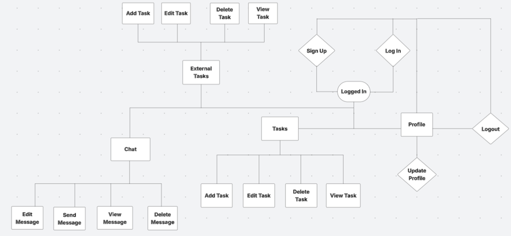

# Productivity App

This website was created for my 4th Portfolio Project with Code Institute. Productivity App is multifacited app with mutliple features including a chat app and a task management system for both site users and site admins (called external users). The purpose behind this app is to provide users in companies or even education centers a platform to manage daily tasks and effectively communicate with each other seemlessly.
 
Live link to the deployed app on heroku - [Productivity App](https://productivity-app-pp4-6c2bd8f4331e.herokuapp.com)
 

## Table of Contents

- [User Experience Design](#user-experience-design)
- [Strategy](#strategy)
  - [User Stories](#user-stories)
- [Scope](#scope)
- [Structure](#structure)
- [Skeleton](#skeleton)
  - [Wireframes](#wireframes)
- [Surface](#surface)

### Features

- [Existing Features](#existing-features)
- [CRUD (Create, Read, Update, Delete)](#crud-create-read-update-delete)
- [Future Features](#future-features)

### Technology

- [Languages Used](#languages-used)
- [Libraries and Programs Used](#libraries-and-programs-used)

### Testing

- [Automated Testing](#automated-testing)
- [Manual Test Cases](#manual-test-cases)
- [Code Validation](#code-validation)
- [Lighthouse Performance Testing](#lighthouse-performance-testing)
- [Debugging](#debugging)
- [Unfixed Bugs](#unfixed-bugs)
- [Testing on Different Browsers and Screen Sizes](#testing-on-different-browsers-and-screen-sizes)

### Deployment

- [Deployment Process](#deployment-process)

### Credits

- [Resources Used](#resources-used)
- [Content Contributors](#content-contributors)
- [Honourable Mentions](#honourable-mentions)

---

## User Experience Design

## Strategy

### __Typical Users__
  
  - A typical Site User would be an employee in a companee or student in a school who needs to have the daily tasks supervised and managed.

  - The Site Admin would be a manager in a company or a teacher in a school that supervises the tasks or regular users.

### User Stories

#### Site User

 

  - Account Register: I can sign up or log in to an account so that I can access all chat and task management features.

  - Edit Profile: I can edit my personal profile to have my own user image and decide what information is displayed.

  - Send Message (Public Channel): I can send a message in a public channel so that I can participate in group discussions.

  - Send Message (Private Channel): I can send a direct message to another user or a group so that I can have private conversations.

  - View Chat History: I can view past messages in a public or private channel so that I can keep track of previous conversations.

  - Edit Message: I can edit my own messages so that I can correct mistakes or update information.

  - Delete Message: I can delete my own messages so that I can remove unwanted or incorrect messages.

  - Manage Tasks: I can create, read, update, and delete my own tasks so that I can keep track of my work.

  - View Task Details: I can view the details of my tasks so that I can understand deadlines, descriptions, and progress.

  - Complete Task: I can mark a task as complete so that I can track progress and know what has been finished.

  - Filter and Sort Tasks: I can filter and sort my tasks by priority, deadline, or status so that I can focus on important tasks.

 

#### Superuser (Admin)

 

  - Manage Public Channels: I can create, edit, and delete public channels so that I can structure discussions properly.

  - Delete Message: I can delete any message in public and private chats so that I can ensure a respectful and safe environment.

  - Manage Tasks (All Users): I can create, update, and delete tasks for any user so that I can oversee task management.

  - View All Tasks: I can view all tasks assigned to users so that I can monitor work progress.

  - Manage User Accounts: I can suspend, delete, or modify user accounts so that I can maintain control over the platform.

 

## Scope

 

An MVP (Minimum Viable Product) approach was taken to the development of this site. The main features deemed as basic requirements for this site were:

- Account Registration
- CRUD Functionality (Both for Site User and Site Admin)
- Device Responsiveness

 For a more detailed explanation of all existing features see [Existing Features](#existing-features). [Future Features](#future-features) were still within the possible scope of this project, they were not necessary at this point in time for the site to still work.

## Structure

### Site Navigation Flowchart

  The Flow chart was made to see the structure of navigation on the page. The flowchart was created with [Lucid](https://lucid.app/documents#/dashboard).

  

## Skeleton

### Wireframes

 

  
Chat page wireframes

  
   

  
   

  
   
  
  

 
 
  

  
Tasks wireframes

  

  

 
 

  
External tasks wireframes

  
   

  

 

 

  
Profile wireframes

  
   

  
   

 

### Database design

- Below is a relational diagram for the design of the database in this project.

 

## Surface

### Design

### Colour-Scheme

The main color schemes for the website are Dark Gray ( #2d2f31, Top Navbar Background) and White (#ffffff, Main Background). Light Blue, Green and Red for links, notifications and buttons and Dark Gray/Black for Text.

### Typography

The Segoe UI font was used throughout the website.

## Features

### __Existing Features__

### Login Page
- This page is where users with existing accounts log in to the app

 

 

### Logout Page
- This page lets users know they've been logged out and gives them the option to log back in.

 

 

### Sign Up Page
- This page is where users have the option to create new accounts.

 

 

### Chat Room Search Page
- Here users can either select one of the public rooms available or enter a private room of their choice to communicate through. 

 

 

### Chat Room Page
- Here users can communicate with one another by sending messages through the different rooms.
- Users are able edit and delete their own messages but not the messages of others.

 

 

### Tasks Page
- The tasks page is where users are able to manage their own tasks by:
  - view their tasks
  - filter their tasks
  - adding new tasks
  - deleting tasks
  - editing the content of tasks
  - editing the status of tasks

 

 

### User Search Page
- Here site admins can search for users and proceed to manage their tasks.

 

 

### External Tasks Page
- Here site admins can manage the tasks of other users.

 

 

### Profile Page
- Here users are able to update their account details as shown in the image.

 

 

### CRUD (Create, Read, Update, Delete)

#### __Site User__

#### Create:

- Can create an account by registering.

- Can create and update their profile (upload image, set info).

- Can send messages in public and private channels.

- Can create tasks for themselves.

- Can comment on tasks.

- Can bookmark or like chat messages.

#### Read:

- Can view public and private chat history through the channel groups.

- Can read all of their tasks and associated details (description, status).

- Can view their own profile and those of users they interact with.

#### Update:

- Can edit their profile.

- Can edit their own messages.

- Can update their own tasks (description, status).

- Can filter/sort their tasks for better organization.

- Can mark tasks as complete.

- Can mark tasks incomplete

#### Delete:

- Can delete their own messages.

- Can delete their own tasks.

 

#### __Site Admin__

#### Create:

- Can create public/private channels.

- Can create tasks for any user.

#### Read:

- Can read all chat messages and all tasks, regardless of user.

#### Update:

- Can update public channels, tasks for any user, and user accounts.

#### Delete:

- Can delete any task.

- Can delete user accounts if needed.

- Can delete public channels if inappropriate or outdated.

 

### __Future Features__

#### Features to implement in the future would include:

- reacting to messages

- commenting on messages

- site admins being able to assign tasks to multiple users

- adding deadlines to tasks

## Technology

### Languages Used

### Libraries and Programs Used

## Testing

### Automated Testing

### Manual Test Cases

### Code Validation

### Lighthouse Performance Testing

### Debugging

### Unfixed Bugs

### Testing on Different Browsers and Screen Sizes

## Deployment

### Deployment Process

## Credits

### Resources Used

### Content Contributors

### Honourable Mentions
