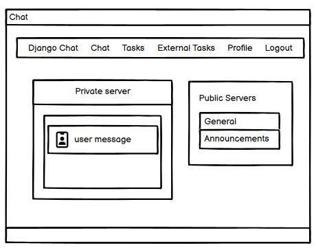

# Productivity App

## Table of Contents

- [User Experience Design](#user-experience-design)
- [Strategy](#strategy)
  - [User Stories](#user-stories)
- [Scope](#scope)
- [Structure](#structure)
- [Skeleton](#skeleton)
  - [Wireframes](#wireframes)
- [Surface](#surface)

### Features

- [Existing Features](#existing-features)
- [CRUD (Create, Read, Update, Delete)](#crud-create-read-update-delete)
- [Other Features](#other-features)
- [Future Features](#future-features)

### Technology

- [Languages Used](#languages-used)
- [Libraries and Programs Used](#libraries-and-programs-used)

### Testing

- [Automated Testing](#automated-testing)
- [Manual Test Cases](#manual-test-cases)
- [Code Validation](#code-validation)
- [Lighthouse Performance Testing](#lighthouse-performance-testing)
- [Debugging](#debugging)
- [Unfixed Bugs](#unfixed-bugs)
- [Testing on Different Browsers and Screen Sizes](#testing-on-different-browsers-and-screen-sizes)

### Deployment

- [Deployment Process](#deployment-process)

### Credits

- [Resources Used](#resources-used)
- [Content Contributors](#content-contributors)
- [Honourable Mentions](#honourable-mentions)

---

## User Experience Design

## Strategy

### User Stories

## Scope

## Structure

## Skeleton

### Wireframes

 

chat page

 

 

tasks

 

 

external tasks

 

 

profile

 

## Surface

## Features

### Existing Features

### CRUD (Create, Read, Update, Delete)

### Other Features

### Future Features

## Technology

### Languages Used

### Libraries and Programs Used

## Testing

### Automated Testing

### Manual Test Cases

### Code Validation

### Lighthouse Performance Testing

### Debugging

### Unfixed Bugs

### Testing on Different Browsers and Screen Sizes

## Deployment

### Deployment Process

## Credits

### Resources Used

### Content Contributors

### Honourable Mentions
